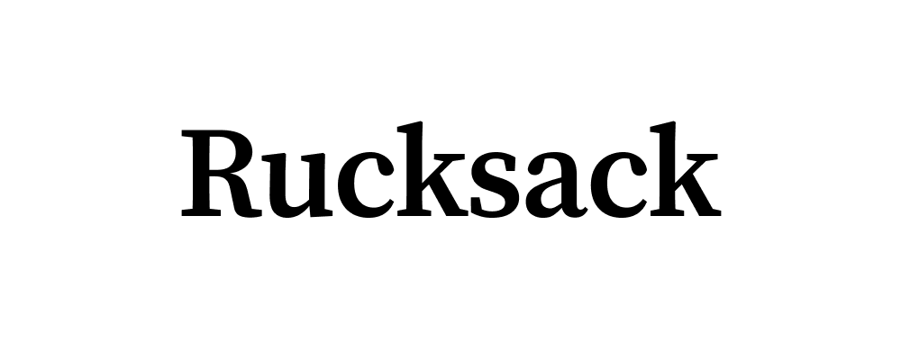

# Rucksack

Rucksack is an open-source platform for hosting your newsletter. It's built on Rails 6, and provides a pretty homepage where readers can subscribe or read your posts. It also includes a dashboard for managing your newsletter.

⚠️ Rucksack is currently in alpha—I do not recommend using this in production.

## Installation

Not sure yet. I imagine it's some combination of the following steps:

1. `git clone https://github.com/kbrgl/rucksack.git`
2. `cd rucksack`
3. Configure your newsletter details. (See below.)
4. `bin/bundle`
5. `bin/yarn`
6. `bin/rails db:create`
7. `bin/rails db:migrate`
8. `bin/rails server`

If something doesn't work, email me and I'll help you get set up.

### Configuration

1. Configure your newsletter details in `app/models/newsletter.rb`
2. Change `public/favicon.ico`
3. Change `app/assets/images/logo.png`

## Roadmap

I'm not sure when I'll have time to implement these, if ever. If you want to take a stab at something, shoot me an email!

- [ ] Tests
- [ ] Auto-saving editor
- [ ] ProseMirror+Markdown instead of Trix+HTML
- [ ] Scheduled publish
- [ ] Prettier emails
- [ ] Unsubscribe button in emails
- [ ] API docs for headless use
- [ ] Settings page that includes publication name
- [ ] Analytics
- [ ] One-click deploy

## Prior Art

Rucksack is inspired by Substack, Revue, and Buttondown.

## License

This project is licensed under the terms of the [GPL 3.0](https://www.gnu.org/licenses/gpl-3.0.en.html) license. You can email me if this doesn't fit your needs.
